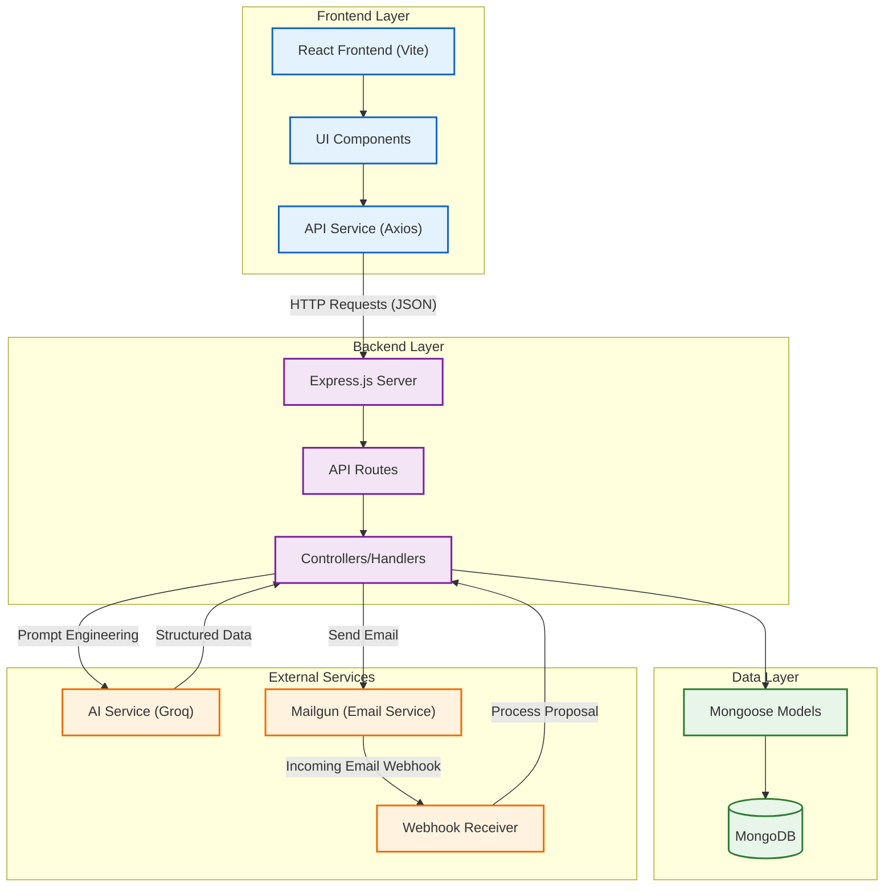

# System Architecture - AI-Powered RFP Management System

This document provides a high-level overview of the system architecture, illustrating the data flow between components.

## Component Description

### 1. Frontend (Client)
*   **Tech Stack:** React, Vite, TailwindCSS.
*   **Role:** User interface for managing RFPs, vendors, and viewing proposals.
*   **Interaction:** Communicates with the backend via RESTful API calls using Axios.

### 2. Backend (Server)
*   **Tech Stack:** Node.js, Express.js.
*   **Role:** core logic, API endpoints, data validation, and orchestration of services.
*   **Key Modules:**
    *   **RFP Management:** CRUD operations for RFPs.
    *   **Vendor Management:** Handling vendor registry.
    *   **Proposal Processing:** Ingesting and analyzing vendor proposals.

### 3. Database
*   **System:** MongoDB (Atlas/Local).
*   **Role:** Persistent storage for:
    *   RFPs (Requests)
    *   Vendors (Profiles)
    *   Proposals (Received responses)
    *   Analyses (AI Comparisons)

### 4. AI Service
*   **Providers:** Groq (groq/compound)
*   **Functions:**
    *   **RFP Extraction:** structured specs from natural language.
    *   **Proposal Parsing:** Extracting price, delivery, and specs from email text.
    *   **Comparison:** Analyzing and ranking multiple proposals against the RFP.

### 5. Email System
*   **Provider:** Mailgun.
*   **Functions:**
    *   **Sending:** Dispatching RFP invitations to vendors.
    *   **Receiving:** Webhooks capture incoming reply emails from vendors.
